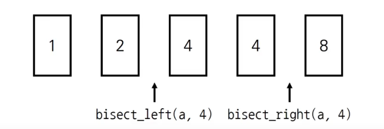

## 🧊 bisect

> 정렬된 리스트에서 특정한 원소(인덱스)를 찾을 때 효과적이다


<br>

### ☁ bisect_left(li, x)

> 정렬된 순서를 유지하면서 리스트 li에 데이터 x를 삽입할 수 있는 가장 왼쪽 인덱스를 반환

### ☁ bisect_right(li, x)

> 정렬된 순서를 유지하면서 리스트 li에 데이터 x를 삽입할 수 있는 가장 오른쪽 인덱스를 반환



``` python
from bisect import bisect_left, bisect_right

li = [1, 2, 4, 4, 8]
x = 4

>>> bisect_left(li, x)  # 인덱스 2, 3, 4중에 가장 왼쪽
2
>>> bisect_right(li, x)
4
```

<br>

### ☁ 개수 구하기 예제

특정 조건에 속하는 원소의 개수를 구하고자 할 때도 효과적이다

``` python
# 특정 점수(score) 이상 개수 

arr = [[] for _ in range(5)]
idx = 0
for i in range(3):
    arr[idx].append(i)  
    
score = 1
>>> len(arr[idx]) - bisect_left(arr[idx], score)  # arr[idx] = [0,1,2] / bisect_left(arr[idx], score) = 1
2
```
