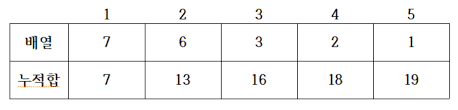
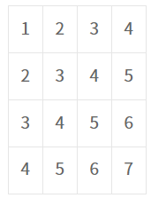
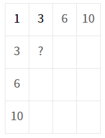

## 🧊 누적 합 (Prefix Sum)

> 합 배열을 만들고, 재사용해서 시간 복잡도를 줄이는 알고리즘

 

### ☁ 누적 합 / 구간 합

- 배열에서 **A[0] + A[1] + .... A[n]** 까지 더한것을 **S[n]**에 저장한다고 하면

  👉 S[n] = A[0] + A[1] + .... A[n] 

- A[i] 부터 A[j]까지의 합을 합배열 없이 구하는 경우, 최악의 경우 0~N 인경우로 시간 복잡도는 **O(N)**

  👉 합 배열을 이용하면 **O(1)**안에 답을 구할 수 있다

✔ 합 배열을 만드는 공식 : **S[i] = S[i-1] + A[i]**

✔ 구간 합 구하기 : **S[j] - S[i-1]**

&nbsp;&nbsp;&nbsp;&nbsp;&nbsp;	2번째 수(i) ~ 4번째 수(j)까지 합을 구하면 = 18 - 7 = 11

 

### ☁ 이차원 구간 합

기존 배열

원점과 붙어있는 항들은 합배열 공식으로 구한다

여기서 물음표 구간은 위에 (1,3 사각형)과 왼쪽에 (1,3 사각형)을 더하고 물음표 자리에 있던 기존배열의 값(A[2] [2] = 3)을 더해준 뒤, 

사각형이 중복으로 더했기 때문에 빼면 된다

✔ 공식 : **S[i] [j] = S[i-1] [j] + S[i] [j-1] - S[i-1] [j-1] + A[i] [j]**

✔ 구간 합 구하기 : **S[x2] [y2] - S[x1-1] [y2] - S[x2] [y1-1] + S[x1-1] [y1-1]**

&nbsp;&nbsp;&nbsp;&nbsp;&nbsp;	(x1, y1)부터 (x2, y2)까지 합

&nbsp;&nbsp;&nbsp;&nbsp;&nbsp;	👉 (2,2)부터 (3,4) 

&nbsp;&nbsp;&nbsp;&nbsp;&nbsp;&nbsp;&nbsp;&nbsp;&nbsp;&nbsp;	= S[3] [4] - S[2-1] [4] - S[3] [2-1] + S[2-1] [2-1]

&nbsp;&nbsp;&nbsp;&nbsp;&nbsp;&nbsp;&nbsp;&nbsp;&nbsp;&nbsp;	= S[3] [4] - S[1] [4] - S[3] [1] + S[1] [1]

&nbsp;&nbsp;&nbsp;&nbsp;&nbsp;&nbsp;&nbsp;&nbsp;&nbsp;&nbsp;	= 42 - 10 - 6 + 1 

&nbsp;&nbsp;&nbsp;&nbsp;&nbsp;&nbsp;&nbsp;&nbsp;&nbsp;&nbsp;	= 27
