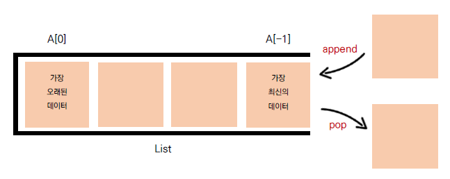

## 🧊 스택 (Stack)

> 데이터를 한쪽에서만 넣고 빼는 자료구조
> 가장 마지막에 들어온 데이터가 가장 먼저 나가므로 LIFO(Last in First out, 후입선출) 방식

<br>

### ☁ 스택



- 파이썬은 리스트로 스택을 간편하게 사용할 수 있다

<br>

### ☁ 스택을 사용하는 이유

- 뒤집기, 되돌리기, 되돌아가기

- 마무리 되지 않은 일을 임시 저장

  👉 괄호 매칭, 함수 호출, 백트래킹, DFS(깊이 우선 탐색)

<br>

### ☁ 스택 풀이

```python
stack = []

for _ in range(int(input())):
    number = int(input())

    if number == 0:
        stack.pop()
    else:
        stack.append(number)

print(sum(stack))
```
