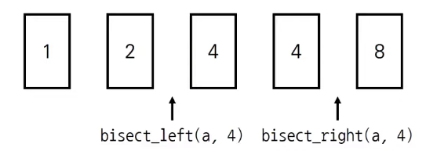

## 🧊 이분 탐색 (Binary Search)

> 정렬되어 있는 리스트에서 탐색 범위를 절반씩 좁혀가며 데이터를 탐색하는 방법
>

<br>

### ☁ 이분 탐색 / 순차 탐색 비교


<br>

### ☁ 이분 탐색 라이브러리

- bisect_left(a, x)

  : 정렬된 순서를 유지하면서 배열 a에 x를 삽입할 가장 왼쪽 인덱스를 반환

- bisect_right(a, x)

  : 정렬된 순서를 유지하면서 배열 a에 x를 삽입할 가장 오른쪽 인덱스를 반환

``` python
from bisect import bisect_left, bisect_right
a = [1, 2, 4, 4, 8]
x = 4

print(bisect_left(a, x))
>>> 2
# 리스트 a에 4를 삽입할 가장 왼쪽 인덱스는 2이다.

print(bisect_right(a, x))
>>> 4
# 리스트 a에 4를 삽입할 가장 오른쪽 인덱스는 4이다.
```


