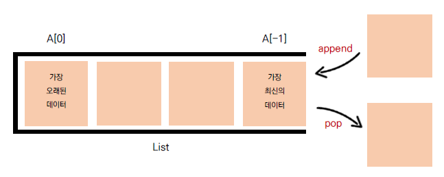

## 🧊 큐 (Queue)

> 큐는 한 쪽 끝에서 데이터를 넣고, 다른 한 쪽에서만 데이터를 뺄 수 있는 자료구조
>
> 가장 먼저 들어온 데이터가 가장 먼저 나가므로 FIFO(First in First out, 선입선출) 방식

<br>

### ☁ 덱(Deque) 자료구조



- 리스트를 이용한 큐는 데이터를 뺄 때 큐 안에 있는 데이터가 많은 경우 비효율적이다

  👉 맨 앞 데이터가 빠지면서, 리스트의 인덱스가 하나씩 당겨 지기 때문

- 덱은 양 뱡향으로 삽입, 삭제가 자유로운 큐

  👉 데이터의 삽입, 삭제가 많은 경우 시간을 크게 단축 시킬 수 있다

✔ 큐 문제는 덱을 이용해서 풀자

<br>

### ☁ 큐와 덱 풀이 비교

#### 큐를 이용한 풀이

``` python
n = int input
queue = list(range(1, n + 1))

while len(queue) > 1:
	print(queue.pop(0), end=" ")
    queue.append(queue.pop(0))
    
print(queue[0])
```

#### 덱을 이용한 풀이

> deque 자료형을 생성하는 collections.deque 모듈을 사용하자

```python
from collections import deque

n = int(input())
queue = deque(range(1, n + 1))

while len (queue) > 1:
	print(queue.popleft(), end=" ")
	queue.append(queue.popleft())

print(queue[0])
```
